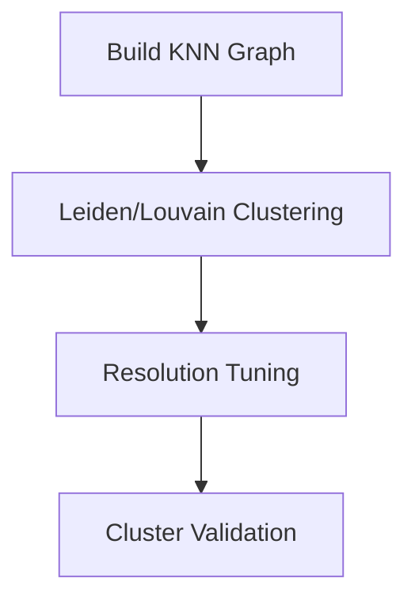
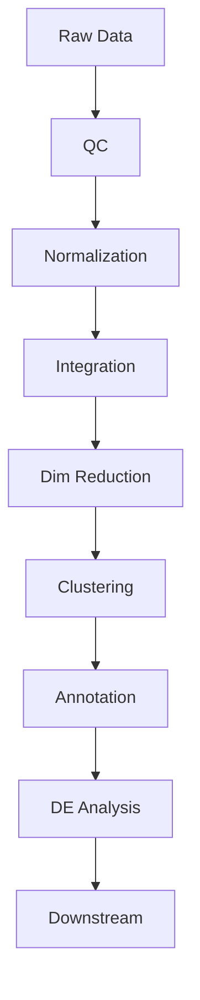

Here's the enhanced Markdown version with improved structure, formatting, and visual elements:

```markdown
# Single-Cell RNA-seq Differential Expression Analysis Pipeline

## Overview
A comprehensive workflow for analyzing multiple scRNA-seq datasets (e.g., 5 healthy vs 10 cancer samples) with emphasis on proper differential expression analysis.

---

## Pipeline Steps

### 1. Initial Quality Control (QC)
**Key Tasks:**
- Calculate QC metrics:
  - Total counts per cell
  - Number of detected genes
  - Mitochondrial/ribosomal gene percentage
- Filter out:
  - Low-quality cells
  - Dead cells (high mitochondrial %)
  - Doublets (using [Scrublet](https://github.com/AllonKleinLab/scrublet) or [DoubletFinder](https://github.com/chris-mcginnis-ucsf/DoubletFinder))

**Visualization:**  
```python
import scanpy as sc
sc.pl.scatter(adata, x='total_counts', y='pct_counts_mt', color='sample_origin')
```

---

### 2. Normalization & Feature Selection
| Step | Method | Purpose |
|------|--------|---------|
| Normalization | Log-normalization or VST | Make counts comparable |
| HVG Selection | Variance-based selection | Focus on biologically relevant genes |
| Scaling | Center & scale genes | Prepare for integration |

**Tip:** Typically select 2000-5000 HVGs for downstream analysis.

---

### 3. Data Integration / Batch Correction
**Integration Methods:**
- [Seurat CCA](https://satijalab.org/seurat/articles/integration_introduction.html)
- [Harmony](https://portals.broadinstitute.org/harmony/)
- [BBKNN](https://github.com/Teichlab/bbknn)

**Quality Check:**  
UMAP colored by:
- Batch (should mix well)
- Biological condition (should show separation if real differences exist)

---

### 4. Dimensionality Reduction
**Two-Step Process:**
1. Linear reduction (PCA)
   - Typically retain 20-50 PCs
2. Non-linear embedding (UMAP/t-SNE)
   - For visualization and exploration

---

### 5. Clustering
**Workflow:**


**Resolution Tips:**
- Start with 0.4-0.8
- Adjust based on known biology (e.g., expect many subtypes → higher resolution)

---

### 6. Cell Type Annotation
**Annotation Strategies:**
1. Marker-based:
   - Manual: Check known markers (e.g., CD3E for T cells)
   - Automated: [SingleR](https://bioconductor.org/packages/release/bioc/html/SingleR.html), [scCATCH](https://github.com/ZJUFanLab/scCATCH)
2. Reference-based:
   - Map to [Azimuth](https://azimuth.hubmapconsortium.org/) or other atlases

---

### 7. Differential Expression Analysis
**Critical Principle:**  
Compare within cell types across conditions (e.g., T cells: healthy vs cancer)

**Analysis Framework:**
```python
# Pseudocode for DE analysis
de_results = []
for cell_type in adata.obs['cell_type'].unique():
    subset = adata[adata.obs['cell_type'] == cell_type]
    result = rank_genes_groups(subset, groupby='condition')
    de_results.append(result)
```

**Statistical Methods:**
- Wilcoxon rank-sum test
- MAST
- DESeq2 (pseudobulk)

---

### 8. Downstream Analyses
**Options:**
- Pathway analysis (GO, KEGG, GSEA)
- Trajectory inference ([PAGA](https://github.com/theislab/paga), [Monocle3](https://cole-trapnell-lab.github.io/monocle3/))
- Cell-cell communication ([CellPhoneDB](https://www.cellphonedb.org/))
- Clinical correlation

---

## Pipeline Roadmap


---

## Key Considerations
1. **Iterative Nature:** Be prepared to revisit earlier steps
2. **Comparison Strategy:** Always compare like-with-like cell populations
3. **Tool Selection:**
   - R: Seurat + Bioconductor
   - Python: Scanpy + scvi-tools
4. **Documentation:** Track all parameters and thresholds used

---

## Example Parameters Table
| Step | Parameter | Typical Value |
|------|----------|---------------|
| QC | min_genes | 200-500 |
| HVG | n_top_genes | 2000-5000 |
| PCA | n_comps | 30-50 |
| Clustering | resolution | 0.4-1.2 |
| DE | logFC threshold | 0.25-0.58 |
```


